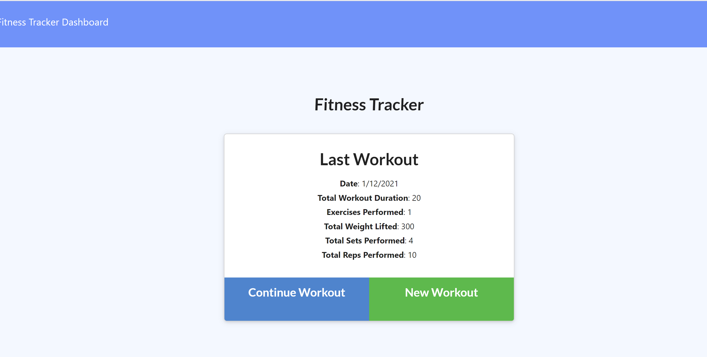
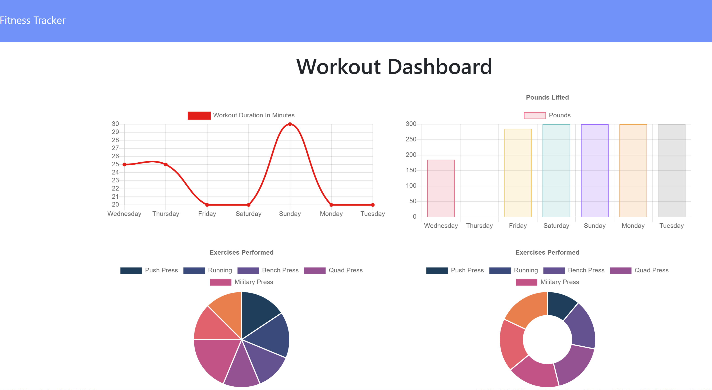

# Workout_Tracker

* View the [Github Repo](https://github.com/girmaD/Workout_Tracker)
* View the [Deployed Heroku link]()

## Description
  This application is a workout tracker application. It uses Mongo database with a Mongoose schema and handles routes with Express. Using this app, a user will be able to view, create and track daily workouts. A user will also to be able to log multiple exercises in a workout on a given day. Furthermore, a user will also be able to track the name, type, weight, sets, reps, and duration of exercise. If the exercise is a cardio exercise, a user will be able to track his/her distance traveled.

    

## Table Of Contents 
* [Installation Instructions](#Installation-Instructions)
* [How To Use The App](#How-To-Use-The-App)
* [Contributing Guidelines](#Contributing-Guidelines)
* [Test Information](#Test-Information)
* [License](#License)
* [Questions](#Questions)

## Installation Instructions

 * fork and use it.
 * Don't forget to install all the modules this app depends on.
 * npm i -> will install all the dependecies

## How To Use The App
- If you fork it, launch the app on the terminal - using (node server.js) or launch it on heroku using the provided heroku link.
- The app will display, the last workout information.
-- if you want to add to the last workout, click continue workout and the entered workout will be added to the last workout. In this way you can enter multiple workout types in the same day.
-- if you want to enter a separate workout, click workout and the entered workout will be entered as a new workout.
- You can also click dashboard on top left corner to view the last seven workout in graph and piechart.

Here is a screen shot of the main page

A screen shot of the stats dashboard may look like this

## Contributing Guidelines
 * contact me on the email provided below

## Test Information
  * No test specified

## License

 * MIT

## Questions

Should you have any questions about this project,
  * you can reach me through email: [girma.derib@gmail.com](mailto:girma.derib@gmail.com) 
  * or visit my [Github Profile](https://github.com/girmaD) for more information.

